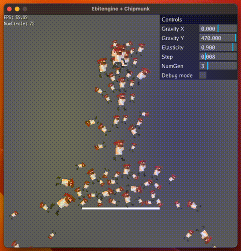

# ebitenlg



A lightweight floating GUI panel library ported to Ebitengine. Inspired by the web-based [lil-gui](https://github.com/georgealways/lil-gui), this Go implementation allows seamless integration with Ebitengine.

## Features
- Lightweight and easy-to-use floating GUI panels
- Seamless integration with Ebitengine


## Usage

First, create a new GUI panel using `ebitenlg.NewGUI()`, then add controls to it. In your main loop, call the `Update()` and `Draw()` methods to render the GUI.

```go
package main

import (
	"image/color"
	_ "image/png"

	"github.com/demouth/ebitenlg"
	"github.com/hajimehoshi/ebiten/v2"
)

const (
	screenWidth  = 600
	screenHeight = 600
)

type Game struct {
	gui *ebitenlg.GUI
}

func (g *Game) Update() error {
	g.gui.Update()
	return nil
}

func (g *Game) Draw(screen *ebiten.Image) {
	screen.Fill(color.NRGBA{0x66, 0x66, 0x66, 0xff})
	g.gui.Draw(screen)
}

func (g *Game) Layout(outsideWidth, outsideHeight int) (int, int) {
	return screenWidth, screenHeight
}

func main() {
	game := &Game{}

	gui := ebitenlg.NewGUI()
	gui.X = screenWidth
	gui.HorizontalAlign = ebitenlg.HorizontalAlignRight

	var default64, min64, max64 float64 = 0.05, -0.1, 0.1
	gui.AddSliderFloat64("float64", default64, min64, max64, func(v float64) {
		// v is the value of the slider
	})

	var default32, min32, max32 float32 = 10.0, -5.0, 20.0
	gui.AddSliderFloat32("float32", default32, min32, max32, func(v float32) {
		// v is the value of the slider
	})

	var defaultInt, minInt, maxInt int = 0, -500, 500
	gui.AddSliderInt("int", defaultInt, minInt, maxInt, func(v int) {
		// v is the value of the slider
	})

	var defaultBool bool = true
	gui.AddButton("button", defaultBool, func(v bool) {
		// v is the value of the button
	})
	game.gui = gui

	ebiten.SetWindowSize(screenWidth, screenHeight)
	ebiten.SetWindowTitle("Ebitengine lil GUI")
	ebiten.RunGame(game)
}
```

## Adding Controllers

### slider

To add a `float64` slider, use the following code:

```go
var default64, min64, max64 float64 = 0.05, -0.1, 0.1
gui.AddSliderFloat64("float64", default64, min64, max64, func(v float64) {
    // v is the value of the slider
})
```


For a `float32` slider, use the following code:

```go
var default32, min32, max32 float32 = 10.0, -5.0, 20.0
gui.AddSliderFloat32("float32", default32, min32, max32, func(v float32) {
    // v is the value of the slider
})
```


To add an `int` slider, use the following code:

```go
var defaultInt, minInt, maxInt int = 0, -500, 500
gui.AddSliderInt("int", defaultInt, minInt, maxInt, func(v int) {
    // v is the value of the slider
})
```


### button

To add a button, set a bool value as follows:

```go

var defaultBool bool = true
gui.AddButton("button", defaultBool, func(v bool) {
    // v is the value of the button
})
```


